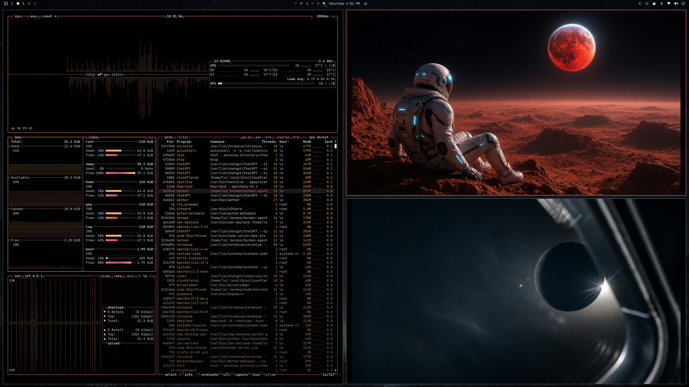

# Eclipse for Omarchy

A dark, lunar-inspired theme for [Omarchy](https://omarchy.org/).



## Install

From a terminal:

```bash
omarchy theme install https://github.com/lo-nau/eclipse-theme.git
```

Or open the Omarchy menu, select **Install → Theme**, and paste:

```text
https://github.com/lo-nau/eclipse-theme.git
```

Omarchy will clone and apply the theme automatically.
